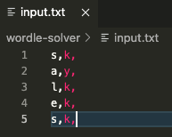
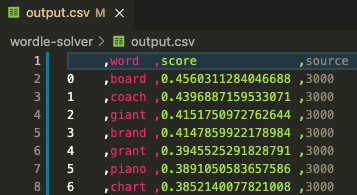

# Wordle Solver

## Isn't this cheating?
I willingly made the choice to use English word data that I dug up on the internet. NOT data from Wordle's list of words. I wanted to develop this system without any "insider" data or knowledge, so that's where I drew the line and defined my problem space.

 

## Usage: 3 Steps

1. Input *ALL* letters, in order, and resultant colors into [input.txt](input.txt) in the following format:
    - g - green
    - y - yellow
    - k - black/grey

  

2. Run [script_get-possible-words.py](script_get-possible-words.py) after you enter each word to get recommendations for next word

3. After running 2., [output.csv](output.csv) will contain the recommended words, ranked by score, in the following format:

  

 

## Refrences/Credits

1. [List of all English words](https://github.com/dwyl/english-words/blob/master/words_alpha.txt)
1. [20,000 most common English words](https://github.com/first20hours/google-10000-english/blob/master/20k.txt)
1. [3,000 most common English words](https://www.ef.edu/english-resources/english-vocabulary/top-3000-words/)
1. [Wordle Archive](https://www.devangthakkar.com/wordle_archive/?1) of past games (for testing)
